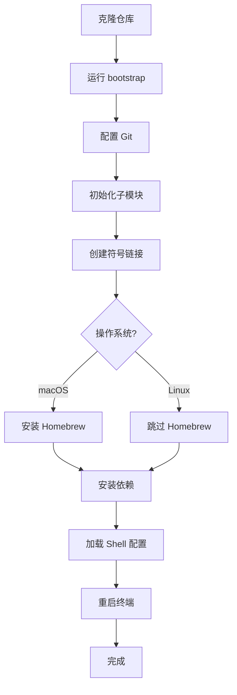
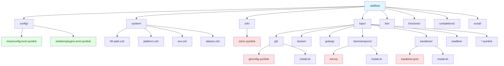

# Modern Dotfiles

现代模块化 zsh 配置，支持版本管理和懒加载。

## 🚀 快速开始

### 前置要求

#### 系统要求
- **操作系统**：
  - macOS 12 (Monterey) 或更高版本
  - Ubuntu 20.04+ 或其他主流 Linux 发行版
- **架构支持**：
  - Apple Silicon (M1/M2/M3) - arm64
  - Intel - x86_64
  - Linux - x86_64/arm64

#### 必需工具
安装前请确认已安装以下工具：

```bash
# 检查 Git (必需)
git --version
# 期望输出: git version 2.x.x 或更高

# 检查 Curl (macOS 自动安装，Linux 可能需要)
curl --version
# 期望输出: curl 7.x.x 或更高

# 检查 Zsh (macOS 默认，Linux 可能需要安装)
zsh --version
# 期望输出: zsh 5.x 或更高
```

#### 网络要求
- 能够访问 GitHub (用于克隆仓库和子模块)
- 能够访问 Homebrew 仓库
- 稳定的网络连接 (首次安装需要下载大量依赖)

#### 权限要求
- 对 `$HOME` 目录的写权限
- macOS 需要 sudo 权限 (用于修改系统设置)
- 建议使用管理员账户

#### 磁盘空间
- 预留至少 5GB 可用空间
- 包含 Homebrew、语言运行时、工具链等

### 一键安装（推荐）

适用于接受默认配置的用户，全程自动化：

```bash
# 1. 克隆仓库
git clone https://github.com/YOUR_USERNAME/dotfiles.git ~/.dotfiles
cd ~/.dotfiles

# 2. 运行初始化脚本
script/bootstrap
```

**脚本会自动完成**：
1. 交互式配置 Git 用户信息
2. 初始化 Git 子模块（tmux 配置）
3. 创建所有必要的符号链接
4. 安装 Homebrew (macOS)
5. 安装所有依赖软件包
6. 配置语言运行时环境
7. 应用系统偏好设置 (macOS)
8. 配置终端和开发工具

**预计时间**：
- macOS: 15-30 分钟 (取决于网络速度)
- Linux: 10-20 分钟

**注意**：安装过程中会提示输入 Git 用户名和邮箱，请准备好这些信息。

### 详细安装流程

如果你希望了解每个步骤或遇到问题，请参考下面的详细安装流程。

#### 步骤 1：准备环境

```bash
# 确认 Zsh 是默认 shell
echo $SHELL
# 如果不是 zsh，运行：
chsh -s $(which zsh)
```

**验证**：
```bash
# 应该输出 /bin/zsh 或 /usr/local/bin/zsh
$SHELL
```

#### 步骤 2：克隆仓库

```bash
# 克隆到 ~/.dotfiles
git clone https://github.com/YOUR_USERNAME/dotfiles.git ~/.dotfiles
cd ~/.dotfiles

# 验证目录结构
ls -la
# 应该看到 script/, bin/, config/, system/ 等目录
```

**验证**：
```bash
# 确认当前在 dotfiles 目录
pwd
# 应该输出: /Users/YOUR_USERNAME/.dotfiles
```

#### 步骤 3：配置 Git（交互式）

```bash
# 运行引导脚本
script/bootstrap
```

脚本会提示你输入：

```
What is your github author name?
[输入你的 Git 用户名]

What is your github author email?
[输入你的 Git 邮箱]
```

**脚本会创建**：
- `~/.gitconfig` → 符号链接到 `dotfiles/git/gitconfig.symlink`
- `~/.gitconfig.local` → 包含你的用户信息 (不被版本跟踪)

**验证**：
```bash
# 检查 Git 配置
git config --global user.name
git config --global user.email
# 应该输出你刚才输入的信息
```

#### 步骤 4：初始化子模块

bootstrap 脚本会自动处理 Git 子模块（tmux 配置）：

**自动初始化**：
- 检测 `.gitmodules` 文件
- 自动运行 `git submodule update --init --recursive`
- 创建 tmux 配置符号链接

**验证**：
```bash
# 检查子模块状态
git submodule status
# 应该看到 tmux 子模块已初始化

# 检查 tmux 配置
ls -la ~/.tmux.conf
# 应该是指向 dotfiles/tmux/.tmux.conf 的符号链接
```

#### 步骤 5：创建符号链接

bootstrap 脚本会自动处理所有符号链接，包括：

**核心配置**：
- `~/.zshrc` → `dotfiles/zsh/zshrc.symlink`
- `~/.gitconfig` → `dotfiles/git/gitconfig.symlink`
- `~/.gitignore` → `dotfiles/git/gitignore.symlink`
- `~/.gemrc` → `dotfiles/ruby/gemrc.symlink`
- `~/.npmrc` → `dotfiles/web/npmrc.symlink`

**外部工具配置**：
- `~/.config/mise/config.toml` → `dotfiles/config/mise/config.toml.symlink`
- `~/.config/sheldon/plugins.toml` → `dotfiles/config/sheldon/plugins.toml.symlink`
- `~/.zplug` → `dotfiles/zplug` (插件目录)

**子模块和新增配置**：
- `~/.tmux.conf` → `dotfiles/tmux/.tmux.conf`
- `~/.hammerspoon` → `dotfiles/hammerspoon`
- `~/.inputrc` → `dotfiles/readline/inputrc.symlink`

**如果文件已存在**，脚本会提示你选择：
- `[s]kip` - 跳过此文件
- `[S]kip all` - 跳过所有冲突
- `[o]verwrite` - 覆盖此文件
- `[O]verwrite all` - 覆盖所有冲突
- `[b]ackup` - 备份此文件 (添加 `.backup` 后缀)
- `[B]ackup all` - 备份所有冲突

**验证**：
```bash
# 检查符号链接
ls -la ~/.zshrc ~/.gitconfig ~/.tmux.conf ~/.hammerspoon
# 应该看到 -> 指向 dotfiles 的符号链接

# 检查外部工具配置
ls -la ~/.config/mise/config.toml
ls -la ~/.config/sheldon/plugins.toml
```

#### 步骤 6：安装依赖（macOS）

如果你在 macOS 上，bootstrap 会自动调用依赖安装：

**子流程**：

1. **应用 macOS 系统设置**
   ```bash
   # 运行系统偏好设置脚本
   macos/set-defaults.sh
   ```
   包括：禁用按键长按、启用 AirDrop 所有网络、Finder 列表视图等

2. **安装 Homebrew**
   ```bash
   # 如果未安装 Homebrew
   homebrew/install.sh
   ```
   自动检测系统架构并安装对应版本

3. **更新 Homebrew**
   ```bash
   brew update
   ```

4. **安装 Brewfile 中的所有软件**
   ```bash
   brew bundle
   ```
   包括：Git、Node.js、Python、Go、tmux、vim 等上百个工具

5. **运行各主题的安装脚本**
   ```bash
   # 自动执行所有 */install.sh
   find . -name install.sh | while read installer; do sh -c "${installer}"; done
   ```

   具体包括：
   - `docker/install.sh` - 安装 Docker 补全
   - `git/install.sh` - 配置 Git 凭据助手
   - `golang/install.sh` - 安装 Go 开发工具
   - `hammerspoon/install.sh` - 配置 Hammerspoon
   - `iterm/install.sh` - 配置 iTerm2 (仅 macOS)
   - `karabiner/install.sh` - 配置 Karabiner-Elements
   - `python/install_fix.sh` - 配置 Python 环境

**预计时间**：15-30 分钟 (首次运行)

**验证**：
```bash
# 检查 Homebrew
brew --version
# 应该显示 Homebrew 版本

# 检查关键工具
mise --version
sheldon --version
starship --version
zoxide --version

# 检查语言运行时
node --version
python --version
go version
ruby --version
```

#### 步骤 7：初始化 Shell 环境

```bash
# 重新加载 Zsh 配置
source ~/.zshrc
```

**加载顺序**：
1. `system/00-path.zsh` - 设置 PATH
2. `system/platform.zsh` - 检测操作系统
3. `system/env.zsh` - 环境变量
4. 各主题的 `*/path.zsh` - 主题特定 PATH
5. Sheldon 插件管理器 - 加载 zsh 插件 (懒加载)
6. Starship - 初始化提示符
7. Zoxide - 初始化智能跳转
8. 各主题的 `*/*.zsh` - 主题配置
9. 各主题的 `*/completion.zsh` - 补全定义
10. `~/.zsh.localrc` - 私有配置 (如果存在)

**验证**：
```bash
# 检查提示符 (应该看到 Starship 提示符)
# 检查 zoxide 是否工作
z /tmp  # 应该跳转到 /tmp
cd ~     # 按 Tab 应该看到智能补全
```

#### 步骤 8：重启终端

```bash
# 完全退出当前终端会话
exit

# 重新打开终端
```

**验证**：
```bash
# 应该看到现代化的 Starship 提示符
# 提示符应该显示：用户名、主机名、Git 分支、语言版本等

# 测试基本功能
ls --color=auto  # 应该有彩色输出
git status       # 应该正常工作
mise list        # 应该显示已安装的工具
```

### 初始化流程图



### 验证安装

运行完整的安装验证：

```bash
# 检查符号链接
ls -la ~/.zshrc ~/.gitconfig ~/.tmux.conf ~/.hammerspoon

# 检查核心工具
mise --version
sheldon --version
starship --version
zoxide --version

# 检查语言运行时
node --version
python --version
go version
ruby --version
rustc --version

# 检查 Shell 功能
zoxide --version  # 智能跳转
fzf --version     # 模糊查找

# 检查 Git
git config user.name
git config user.email

# 检查子模块
git submodule status

# 检查补全
docker [Tab]
git [Tab]
```

**预期结果**：
- 所有命令都正常输出版本信息
- 补全功能正常工作
- Starship 提示符正常显示
- 符号链接都指向 dotfiles 目录

---

## ⚙️ 安装后配置

### 必要配置

#### 1. 创建私有配置文件

私有配置文件用于存储敏感信息，不会被 Git 跟踪：

```bash
# 复制模板
cp ~/.dotfiles/system/private.zsh.template ~/.zsh.localrc

# 编辑文件，添加你的配置
vim ~/.zsh.localrc
```

**常用配置项**：
```bash
# API 密钥
export GITHUB_TOKEN="ghp_..."
export HOMEBREW_GITHUB_API_TOKEN="ghp_..."

# 工作路径
export WORK_PROJECTS="$HOME/work/projects"

# 数据库 URLs
export DATABASE_URL="postgresql://..."

# 自定义别名
alias myproject='cd $WORK_PROJECTS/myproject'
```

#### 2. 配置语言运行时

Mise 已经配置了默认版本，你可以根据需要调整：

```bash
# 查看已安装的版本
mise list

# 安装特定版本
mise install node@20.0.0
mise install python@3.12.0

# 设置全局默认版本
mise use -g node@20.0.0

# 验证
node --version
python --version
```

#### 3. 配置 Tmux（可选）

Tmux 配置已自动链接，但你可以创建本地定制：

```bash
# .tmux.conf.local 用于本地定制
# 不会被子模块更新覆盖

vim ~/.tmux.conf.local
```

### 可选配置

#### iTerm2 配置（仅 macOS）

如果你使用 iTerm2：

```bash
# 配置文件已在安装时自动生成
# 现在需要手动导入：

# 1. 打开 iTerm2
# 2. Preferences -> General -> Preferences
# 3. 勾选 "Load preferences from a custom folder"
# 4. 设置路径为: ~/.dotfiles/iterm
```

#### Docker 补全

Docker 相关的补全脚本已在安装时下载：

```bash
# 验证补全文件
ls -la ~/.docker/completions/
# 应该看到: _docker, _docker-compose, _docker-machine

# 测试补全
docker [按 Tab]  # 应该看到子命令补全
```

#### Go 开发工具

Go 工具链已在安装时配置：

```bash
# 验证 GOPATH
echo $GOPATH
# 应该输出: $HOME/go 或你配置的路径

# 检查已安装的工具
ls $GOPATH/bin/
# 应该看到: gopls, goimports, staticcheck 等工具

# 测试补全
go [按 Tab]  # 应该看到 go 命令补全
```

#### Python 环境

```bash
# Python 由 mise 管理
python --version

# 安装常用包
pip install --user pipx
pipx ensurepath

# 验证
which pipx
```

#### Hammerspoon 配置

Hammerspoon 配置已自动链接到 `~/.hammerspoon`：

```bash
# 重新加载 Hammerspoon 配置
# 点击菜单栏的 Hammerspoon 图标
# 选择 "Reload Config"

# 主要功能：
# - Caps Lock 映射为 Control/Escape
# - Super Duper 模式（键盘导航）
# - 窗口布局管理
# - Markdown 模式
# - Hyper 键应用启动器
```

#### Karabiner-Elements 配置

Karabiner 配置已在安装时复制：

```bash
# 配置文件位置
~/.config/karabiner/karabiner.json

# 重新加载配置
# 打开 Karabiner-Elements Preferences
# 点击 "Reload XML"
```

---

## 🔧 故障排查

### 常见问题

#### 问题 1：bootstrap 脚本执行失败

**症状**：
```
error installing dependencies
```

**解决方案**：
```bash
# 1. 检查网络连接
ping -c 3 github.com
ping -c 3 raw.githubusercontent.com

# 2. 手动安装 Homebrew
/bin/bash -c "$(curl -fsSL https://raw.githubusercontent.com/Homebrew/install/HEAD/install.sh)"

# 3. 重新运行 bootstrap
cd ~/.dotfiles
script/bootstrap
```

#### 问题 2：Git 配置未生效

**症状**：
```bash
git config user.name
# 输出为空
```

**解决方案**：
```bash
# 检查配置文件是否存在
ls -la ~/.gitconfig.local

# 如果不存在，手动创建
cp ~/.dotfiles/git/gitconfig.local.symlink.example ~/.gitconfig.local

# 编辑文件，填入你的信息
vim ~/.gitconfig.local
```

#### 问题 3：Zsh 插件加载失败

**症状**：
```
command not found: sheldon
```

**解决方案**：
```bash
# 1. 检查 Sheldon 是否安装
which sheldon

# 2. 如果未安装，通过 Homebrew 安装
brew install sheldon

# 3. 重新加载配置
source ~/.zshrc
```

#### 问题 4：mise 工具未找到

**症状**：
```bash
mise: command not found
```

**解决方案**：
```bash
# 1. 检查 mise 是否安装
which mise

# 2. 如果未安装，通过 Homebrew 安装
brew install mise

# 3. 重新加载配置
source ~/.zshrc

# 4. 验证
mise list
```

#### 问题 5：符号链接冲突

**症状**：
```
File already exists: ~/.zshrc
```

**解决方案**：
```bash
# 选择 1: 备份现有文件
mv ~/.zshrc ~/.zshrc.backup

# 选择 2: 删除现有文件 (如果确定不需要)
rm ~/.zshrc

# 选择 3: 手动创建链接
ln -s ~/.dotfiles/zsh/zshrc.symlink ~/.zshrc
```

#### 问题 6：macOS 系统设置未生效

**症状**：
某些 macOS 偏好设置没有应用

**解决方案**：
```bash
# 重新运行系统设置脚本
~/.dotfiles/macos/set-defaults.sh

# 重启相关应用
killall Finder
killall Dock
```

#### 问题 7：Python 环境问题

**症状**：
```bash
python: command not found
```

**解决方案**：
```bash
# 1. 检查 mise 是否正常
mise list

# 2. 安装 Python
mise install python@latest

# 3. 设置为默认版本
mise use -g python@latest

# 4. 重新加载 Shell
source ~/.zshrc

# 5. 验证
python --version
```

#### 问题 8：Go 工具安装失败

**症状**：
golang/install.sh 执行失败

**解决方案**：
```bash
# 1. 检查 Go 是否安装
go version

# 2. 检查 GOPATH
echo $GOPATH

# 3. 如果 GOPATH 未设置，添加到 ~/.zsh.localrc
echo 'export GOPATH="$HOME/go"' >> ~/.zsh.localrc
echo 'export PATH="$GOPATH/bin:$PATH"' >> ~/.zsh.localrc

# 4. 重新加载
source ~/.zshrc

# 5. 手动安装工具
~/.dotfiles/golang/install.sh
```

### 获取帮助

如果以上解决方案都无法解决你的问题：

**1. 查看日志**：
```bash
# Bootstrap 日志
cat /tmp/dotfiles-dot

# Shell 错误日志
tail -f ~/.zsh_errors
```

**2. 调试模式**：
```bash
# 以调试模式运行
zsh -x ~/.zshrc
```

**3. 提交 Issue**：
- 访问: https://github.com/YOUR_USERNAME/dotfiles/issues
- 附上系统信息: `uname -a`
- 附上错误日志

### 手动卸载

如果需要完全移除 dotfiles：

```bash
# 1. 删除符号链接
rm ~/.zshrc
rm ~/.gitconfig
rm ~/.gitignore
rm ~/.tmux.conf
rm ~/.hammerspoon
rm ~/.gemrc
rm ~/.npmrc
rm ~/.inputrc
rm -rf ~/.config/mise
rm -rf ~/.config/sheldon
rm ~/.zplug

# 2. 删除 dotfiles 目录
rm -rf ~/.dotfiles

# 3. 切换回默认 shell (可选)
chsh -s /bin/bash

# 4. 重启终端
```

**注意**：这不会卸载通过 Homebrew 安装的软件包。如果需要：
```bash
# 卸载所有通过 Brewfile 安装的软件
brew bundle --file=~/.dotfiles/Brewfile uninstall --force

# 卸载 Homebrew (不推荐)
/bin/bash -c "$(curl -fsSL https://raw.githubusercontent.com/Homebrew/install/HEAD/uninstall.sh)"
```

---

## 📚 核心概念

### 目录结构



**详细说明**：

- **config/**：外部工具配置
  - `mise/` - 版本管理器配置
  - `sheldon/` - 插件管理器配置

- **system/**：核心系统设置
  - `00-path.zsh` - PATH 配置
  - `platform.zsh` - 平台检测
  - `env.zsh` - 环境变量
  - `aliases.zsh` - 通用别名
  - `private.zsh.template` - 私有配置模板

- **zsh/**：Zsh 核心配置
  - `zshrc.symlink` - 主配置文件
  - `config.zsh` - 配置加载
  - `completion.zsh` - 补全系统
  - `prompt.zsh` - 提示符配置

- **topic/**：主题模块
  - `git/` - Git 相关配置
  - `docker/` - Docker 配置
  - `golang/` - Go 开发配置
  - `hammerspoon/` - Hammerspoon 自动化配置
  - `karabiner/` - Karabiner 键盘映射
  - `readline/` - Readline 配置
  - `*.symlink` - 符号链接文件

- **bin/**：可执行脚本
- **functions/**：自定义函数
- **completions/**：补全脚本
- **script/**：安装和维护脚本
- **tmux/**：Tmux 配置（Git 子模块）

### 符号链接规则

**自动链接规则**：
- `*.symlink` 文件自动链接到 `$HOME`
  - 例如：`git/gitconfig.symlink` → `~/.gitconfig`
- 配置文件链接到 `$XDG_CONFIG_HOME`
  - 例如：`config/mise/config.toml.symlink` → `~/.config/mise/config.toml`
- 目录可以直接链接
  - 例如：`hammerspoon/` → `~/.hammerspoon`

**加载优先级**：
1. `*/path.zsh` - 最先加载，设置 PATH
2. `*.zsh` - 按需加载
3. `*/completion.zsh` - 最后加载，设置补全

### 配置加载顺序

Zsh 配置的加载顺序（在 `zsh/zshrc.symlink` 中定义）：

1. `system/00-path.zsh` - 设置 PATH
2. `system/platform.zsh` - 检测操作系统
3. `system/env.zsh` - 环境变量
4. 各主题的 `*/path.zsh` - 主题特定 PATH
5. Sheldon 插件管理器 - 加载 zsh 插件 (懒加载)
6. Starship - 初始化提示符
7. Zoxide - 初始化智能跳转
8. 各主题的 `*/*.zsh` - 主题配置
9. 各主题的 `*/completion.zsh` - 补全定义
10. `~/.zsh.localrc` - 私有配置 (如果存在)

---

## 🛠️ 核心工具链

### 版本管理（mise）

**作用**：统一管理所有语言运行时和工具

**配置文件**：`~/.config/mise/config.toml`

**常用命令**：
```bash
# 列出已安装的工具
mise list

# 安装特定版本
mise install node@20.0.0

# 设置全局默认版本
mise use -g node@20.0.0

# 查看可用版本
mise list-remote node

# 升级所有工具
mise upgrade
```

**自定义方法**：
编辑 `~/.config/mise/config.toml` 添加新的工具和版本。

### 插件管理（sheldon）

**作用**：管理 Zsh 插件，支持懒加载

**配置文件**：`~/.config/sheldon/plugins.toml`

**常用命令**：
```bash
# 更新插件
sheldon lock --update

# 重新加载配置
source ~/.zshrc

# 查看插件状态
sheldon status
```

**自定义方法**：
编辑 `~/.config/sheldon/plugins.toml` 添加新插件。

### 提示符（starship）

**作用**：跨 shell 的现代化提示符

**配置文件**：`~/.config/starship.toml`

**常用命令**：
```bash
# 编辑配置
vim ~/.config/starship.toml

# 重新加载
source ~/.zshrc
```

**自定义方法**：
编辑 `~/.config/starship.toml` 自定义提示符样式。

### 智能跳转（zoxide）

**作用**：智能的 cd 替代品，记住常用目录

**常用命令**：
```bash
# 跳转到目录
z /tmp
z dotfiles

# 查看目录历史
zi

# 交互式选择
zoi
```

**自定义方法**：
通过环境变量配置，参考 `zoxide --help`。

---

## 🎯 配置说明

### 主题模块设计

每个主题（topic）是一个独立的功能模块：

**目录结构**：
```
topic/
├── *.zsh           # 自动加载的配置
├── path.zsh        # PATH 设置（优先加载）
├── completion.zsh  # 补全设置（最后加载）
├── *.symlink       # 符号链接到 $HOME
└── install.sh      # 安装脚本（可选）
```

**自动加载机制**：
- `bootstrap` 脚本会自动执行所有 `*/install.sh`
- Zsh 启动时自动加载所有 `*.zsh` 文件
- 按优先级加载：`path.zsh` → `*.zsh` → `completion.zsh`

### 自定义配置方法

#### 添加新的 Zsh 配置

```bash
# 在对应的主题目录下创建 .zsh 文件
# 例如：添加 Git 别名
vim ~/.dotfiles/git/aliases.zsh

# 添加内容：
alias gs='git status'
alias ga='git add'
alias gc='git commit'
alias gp='git push'

# 重新加载
source ~/.zshrc
```

#### 添加新的主题模块

```bash
# 创建新主题目录
mkdir ~/.dotfiles/mytopic

# 添加配置文件
touch ~/.dotfiles/mytopic/aliases.zsh
touch ~/.dotfiles/mytopic/completion.zsh

# 添加安装脚本 (可选)
cat > ~/.dotfiles/mytopic/install.sh << 'EOF'
#!/bin/sh
info 'installing mytopic'
# 你的安装逻辑
success 'mytopic installed'
EOF

chmod +x ~/.dotfiles/mytopic/install.sh

# 重新加载
source ~/.zshrc
```

### 私有配置管理

**使用 `~/.zsh.localrc`**：
```bash
# 编辑私有配置文件
vim ~/.zsh.localrc

# 添加你的配置
export MY_API_KEY="..."
alias mycommand='...'
export WORK_PROJECTS="$HOME/work"

# 私有配置不会被 Git 跟踪
git status  # 不会显示 ~/.zsh.localrc
```

**配置模板**：
参考 `system/private.zsh.template` 查看常用配置项。

---

## 🔄 维护和更新

### 更新 dotfiles

定期更新到最新版本：

```bash
# 1. 进入 dotfiles 目录
cd ~/.dotfiles

# 2. 拉取最新更改
git pull origin master

# 3. 更新子模块
git submodule update --remote --merge

# 4. 重新运行 bootstrap (可选)
script/bootstrap

# 5. 重新加载 Shell 配置
source ~/.zshrc
```

### 更新 Homebrew 软件包

```bash
# 更新 Homebrew
brew update

# 升级所有软件包
brew upgrade

# 清理旧版本
brew cleanup

# 根据最新的 Brewfile 重新安装
brew bundle --file=~/.dotfiles/Brewfile
```

### 更新语言运行时

```bash
# 更新 mise 管理的所有工具
mise upgrade

# 更新特定工具
mise upgrade node
mise upgrade python

# 查看可用的新版本
mise latest node
mise latest python
```

### 更新 Shell 插件

```bash
# Sheldon 会自动管理插件更新
# 手动更新所有插件
sheldon lock --update

# 重新加载配置
source ~/.zshrc
```

### 更新 Tmux 子模块

Tmux 配置是基于著名的 [gpakosz/.tmux](https://github.com/gpakosz/.tmux) 项目，定期会有更新。

```bash
# 更新到最新版本
cd ~/.dotfiles
git submodule update --remote tmux

# 重新加载 tmux 配置
tmux source-file ~/.tmux.conf
```

### 添加自定义配置

#### 添加新的 Zsh 配置

```bash
# 在对应的主题目录下创建 .zsh 文件
# 例如：添加 Git 别名
vim ~/.dotfiles/git/aliases.zsh

# 添加内容：
alias gs='git status'
alias ga='git add'
alias gc='git commit'

# 重新加载
source ~/.zshrc
```

#### 添加新的主题模块

```bash
# 创建新主题目录
mkdir ~/.dotfiles/mytopic

# 添加配置文件
touch ~/.dotfiles/mytopic/aliases.zsh
touch ~/.dotfiles/mytopic/completion.zsh

# 添加安装脚本 (可选)
cat > ~/.dotfiles/mytopic/install.sh << 'EOF'
#!/bin/sh
# 你的安装逻辑
echo "Installing mytopic..."
EOF

chmod +x ~/.dotfiles/mytopic/install.sh

# 重新加载
source ~/.zshrc
```

#### 添加私有配置

```bash
# 编辑私有配置文件
vim ~/.zsh.localrc

# 添加你的配置
export MY_API_KEY="..."
alias mycommand='...'

# 私有配置不会被 Git 跟踪
git status  # 不会显示 ~/.zsh.localrc
```

### 多机同步

#### 方法 1：使用 Git

```bash
# 在每台机器上
git clone https://github.com/YOUR_USERNAME/dotfiles.git ~/.dotfiles
cd ~/.dotfiles
script/bootstrap

# 机器特定的配置放在 ~/.zsh.localrc
```

#### 方法 2：使用 Mackup（推荐）

```bash
# Mackup 可以同步应用程序设置
# 已包含在 Brewfile 中

# 配置 Mackup
vim ~/.mackup.cfg

# 备份当前设置
mackup backup

# 在新机器上恢复
mackup restore
```

### 定期维护任务

建议创建定期维护脚本：

```bash
# 创建维护脚本
cat > ~/maintenance.sh << 'EOF'
#!/bin/bash

echo "开始维护..."

# 更新 dotfiles
cd ~/.dotfiles
git pull
git submodule update --remote --merge

# 更新 Homebrew
brew update
brew upgrade
brew cleanup

# 更新 mise
mise upgrade

# 更新 Sheldon 插件
sheldon lock --update

# 清理系统缓存
mise cache clean
brew cleanup

echo "维护完成！"
EOF

chmod +x ~/maintenance.sh
```

---

## 📖 原始项目

基于 [holman/dotfiles](https://github.com/holman/dotfiles) 的主题化架构理念。

## 📄 License

MIT
